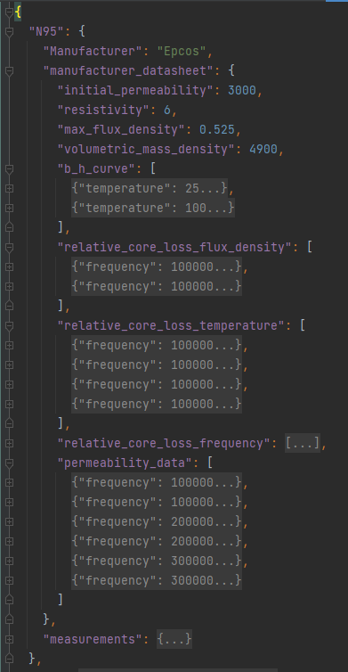
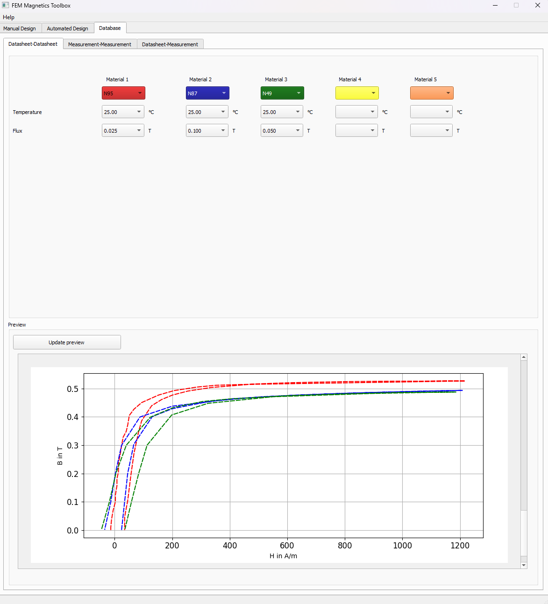
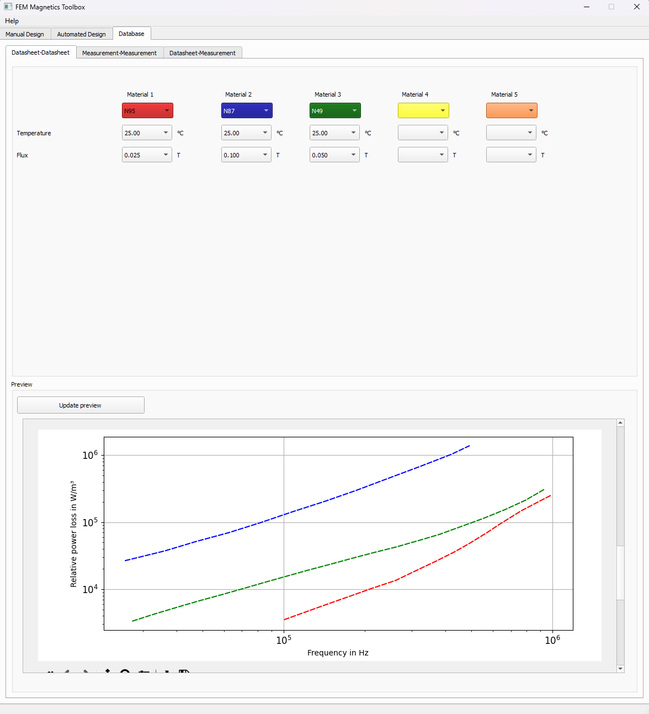

.. sectnum::

Material database for power electronic usage
===============================================

The main purpose of the material database is to provide various materials for FEM simulations or other calculations in which material data from data sheets or own measurements are required.

Possible application scenarios:

* FEM Magnetics Toolbox (FEMMT) loads the permeability or the conductivity of the core from the database, depending on the material.
* Graphical user interface (GUI) in FEMMT can compare properties of the material stored in material database.

Overview features
-------------------

Usable features
~~~~~~~~~~~~~~~~~

* Human-readable database based on a .json-file

* Input features:
    * Write magnetic parameters into the database
        * Amplitude of permeability
        * Angle of permeability
        * Power loss density (hysteresis losses)
        * Magnetic flux density
        * Magnetic field strength

    * Write electric parameters into the database
        * Amplitude of permittivity
        * Angle of permittivity
        * Power loss density (eddy current losses)
        * Electric flux density
        * Electric field strength

    * Write datasheet data into the database

* Output features:
    * Get the magnetic parameters from the database
    * Providing permeability and permittivity data for `FEMMT <https://github.com/upb-lea/FEM_Magnetics_Toolbox>`__

* Interpolation of material data (both electric and magnetic parameters)

* GUI features (included in `FEMMT <https://github.com/upb-lea/FEM_Magnetics_Toolbox>`__):
    * Compare the datasheet values of different ferrite cores (e.g. BH-curves or power-loss curves)
    * Materials for comparison:
        * N95
        * N87
        * N49
        * PC200
        * DMR96A

Planned features (Roadmap for 202x)
~~~~~~~~~~~~~~~~~~~~~~~~~~~~~~~~~~~~~~~~~

* Input features:
    * Universal function to write data into the database

* Output features:
    * Get the electric parameters from the database
    * Extract data from the database as a specific data file (e.g. .csv)

* Plotting features:
    * Plot the data of a specific ferrite material, e.g. the amplitude of the permeability over the magnetic flux density

* Filter features:
    * Get all available data for specific filter keys (e.g. temperature, frequency, material etc.)
    * Filter for some specific value intervals (e.g. 10mT < B-flux < 30mT)

Installation
---------------

::

    pip install materialdatabase

Basic usage and minimal example
------------------------------------

Material properties:
::

    material_db = mdb.MaterialDatabase()
    materials = material_db.material_list_in_database()
    initial_u_r_abs = material_db.get_material_property(material_name="N95", property="initial_permeability")
    core_material_resistivity = material_db.get_material_property(material_name="N95", property="resistivity")

Interpolated permeability and permittivity data of a Material:

::

    b_ref, mu_r_real, mu_r_imag = material_db.permeability_data_to_pro_file(temperature=25, frequency=150000, material_name = "N95", datatype = "complex_permeability",
                                          datasource = mdb.MaterialDataSource.ManufacturerDatasheet, parent_directory = "")

    epsilon_r, epsilon_phi_deg = material_db.get_permittivity(temperature= 25, frequency=150000, material_name = "N95", datasource = "measurements",
                                          datatype = mdb.MeasurementDataType.ComplexPermittivity, measurement_setup = "LEA_LK",interpolation_type = "linear")

These function return complex permittivity and permeability for a certain operation point defined by temperature and frequency.

GUI (FEMMT)
-------------------

The materials in database can be compared with help GUI in FEM magnetics toolbox. In database tab of GUI, the loss graphs and B-H curves from the datasheets of up to 5 materials can be compared.

FEMMT can be installed using the python pip package manager.

::

    pip install femmt

For working with the latest version, refer to the `documentation <https://upb-lea.github.io/FEM_Magnetics_Toolbox/intro.html>`__

|gui_database|

|gui_database_loss|

Bug Reports
--------------

Please use the issues report button within github to report bugs.

Changelog
------------

Find the changelog `here <CHANGELOG.md>`__.

Materialdatabase function documentation
==================================================
.. currentmodule:: materialdatabase.material_data_base_classes

.. automodule:: materialdatabase.material_data_base_functions
   :members:

